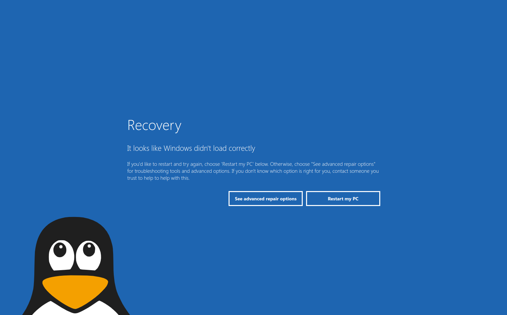

# BSOD
### Blog Screen  of Death
As a Linux fanboy I thought it would be amusing to troll the Windows cronies after the escapades of the last day or so. :-)

This is an HTML, CSS and Javascript recreation of the BSOD including interactive elements (although they don't go anywhere).

Five seconds after loading the Linux penguin makes a visit by popping his head up in the bottom left of the screen.

### Screenshot

